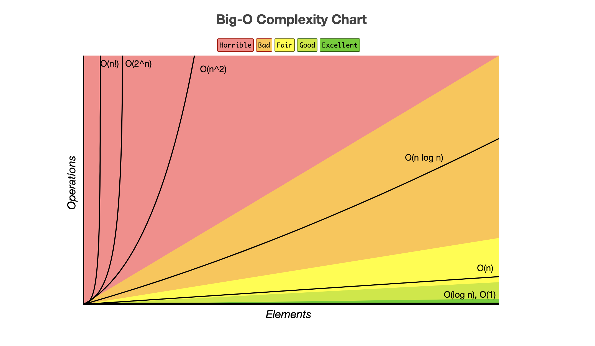
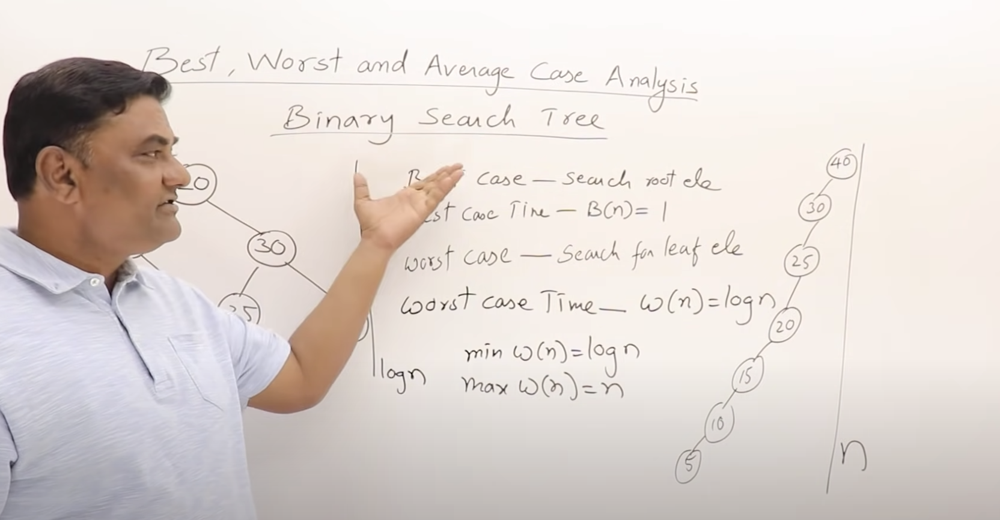

## Types of Time functions:

- Constant
- Logarithmic
- Linear
- Quadratic
- Cubic
- Exponential 2^n, 3^n, n^n.

**_ 1 < logn< sqrt(n) < n < nlogn < n^2 < n^2 logn < n^3 < 2^n < 3^n < n^n_**

- n! there's no particular place. it varies based on value of n.
- n! = O(n^n) or omega(1)

- log n! = O(n logn) or omega (1)

## Comparision of Functions:

1. Substitute with number and compare

- Example: n^2 and n^3 => 10^2 < 10^3

2. Apply log on both sides.

- Example: n^2 and n^3 => log n^2 and log n^3 => 2 logn < 3 logn.

### Log Functions-

1. `log ab = log a + log b`
2. ` log a / log b = log a - log b`
3. ` log a^b = b log a`
4. `a ^ (log b / log c) = b ^ (log a / log c)`
5. `a^b = n => b log n / log a`

## Compare functions

1. n^2 logn, n(logn)^10. >
2. 3n^(sqrt n), 2^ (sqrt n logn).
3. n^logn, 2^sqrt(n)

## Best Case, Average Case, Worst Case Analysis

- Understand this by taking an algorithm as an example.

1. Best case- least amount of time taken.
2. Worst case- maximum amount of time taken.
3. Average case- total amount of time for all possible cases/ total number of cases.

- Linear Search - O(1), O(n), O(1+2+3+..+n)/n= O(n)
- We can represent these cases by any notation- O, omega, theta.
- Binary Search Tree- Best case: O(1), Average case is O(logn) and worst case is O(n) `Searching for leaf`

