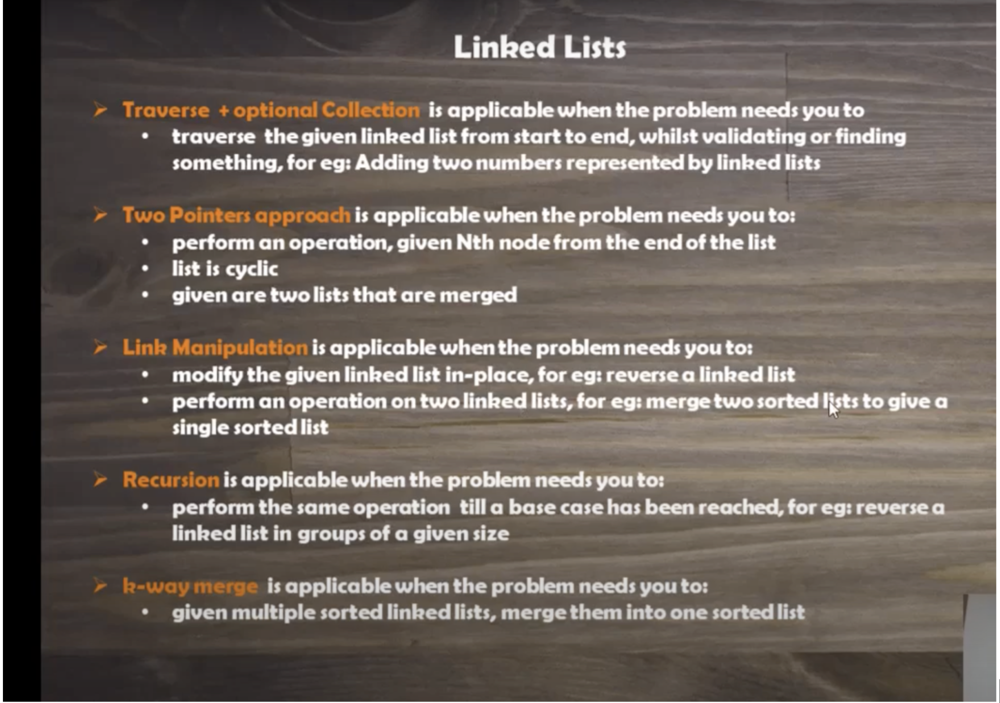

## Linked List

- Linear Collection of elements called nodes where each node has a pointer to the next node. Group of nodes which represent a sequence.
- Linked list is not contigous location like arrays.

### TC:

- Insertion O(1) O(n) #average case, worst case
- Deletion O(1) O(n)
- Search O(n) O(n)
- Accessing O(n) O(n)

- Linked List - inserting is O(1) but searching for that node is O(n)

### Singly-Linked List

- Each node points to the next node and the last node to null.

### Doubly-Linked List

- Each node has two pointers p and n. p to the previous node and n to the next node. Last node to the null.

### Circular Linked-List

- Each node has a pointer to the next node. Last node to the first node.

