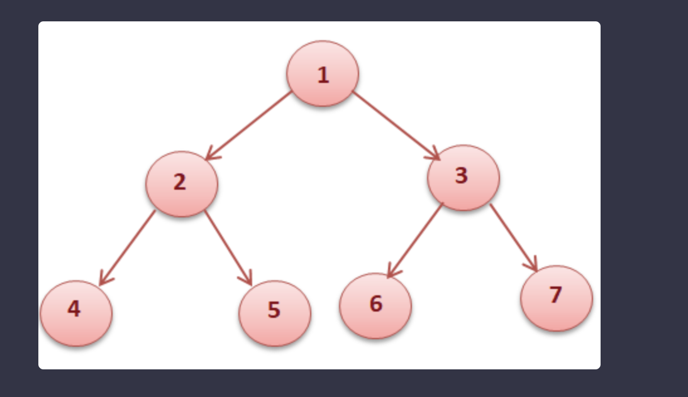

## Binary Tree Traversal 



## Pre-Order traversal

- node first then leaf 
- Visit the root.
- Traverse the left subtree in Preorder.
- Traverse the right subtree in Preorder.
- 1245367

## In-Order traversal 

- Traverse the left subtree in Inorder.
- Visit the root.
- Traverse the right subtree in Inorder.
- 4251637

## Level-order traversal 

- most straight forward.
- similar to BFS. 
- go be level 
- 1234567

## Post-order traversal 

- 4526731
- Traverse the left subtree
- Traverse the right subtree
- Visit the root. 

## Vertical Order Traversal 

- idea is to visit every node and add to the dictionary
dictionary should look like this - ```{ vertical : [(level, val), (level, val)], vertical: [(level, value)]}```

- Now after completing the dictionary. 
- Sort the dictionary based on vertical and then sort based on level

Pre order- root, left, right
In order- left, root, right
Post order left, right, root
Level order by level 

```
Def preOrder(root):
	If not root:
		Return null
	print(root.val)
	(preOrder(root.left))
	(preOrder(root.right))

Tc: O(n)
Sc: O(h)

Def inOrder(root):
	If not root:
		Return null
	inOrder(root.left)
	print(root.val)
	inOrder(root.right)


Def postOrder(root):
	If not root:
		Return null
	postOrder(root.left)
	postOrder(root.right)
	print(root.val)

def levelOrder(root):
    q = collections.deque()
    q.append(root)
    result = []

    while q:
        level = []
        for i in range(len(q)):
            node = q.popleft()
            if node:
                level.append(node.val)
                q.append(node.left)
                q.append(node.right)
        if level:
            result.append(level)
    return result

def verticalTraversal(root):
    vertical = 0
    level = 0
    dic = {}
    helper(root, vertical, level, dic)
    res = []
    for vertical in sorted(dic.keys()):
        column = []
        for level, val in sorted(dic[vertical]):
            column.append(val)
        res.append(column)
    return res


def helper(root, vertical, level, dic):
    if vertical not in dic:
        dic[vertical] = [(level, dic)]
    else:
        dic[vertical].append([(level, dic)])

    helper(root.left, vertical - 1, level + 1, dic)
    helper(root.right, vertical + 1, level + 1, dic)

```