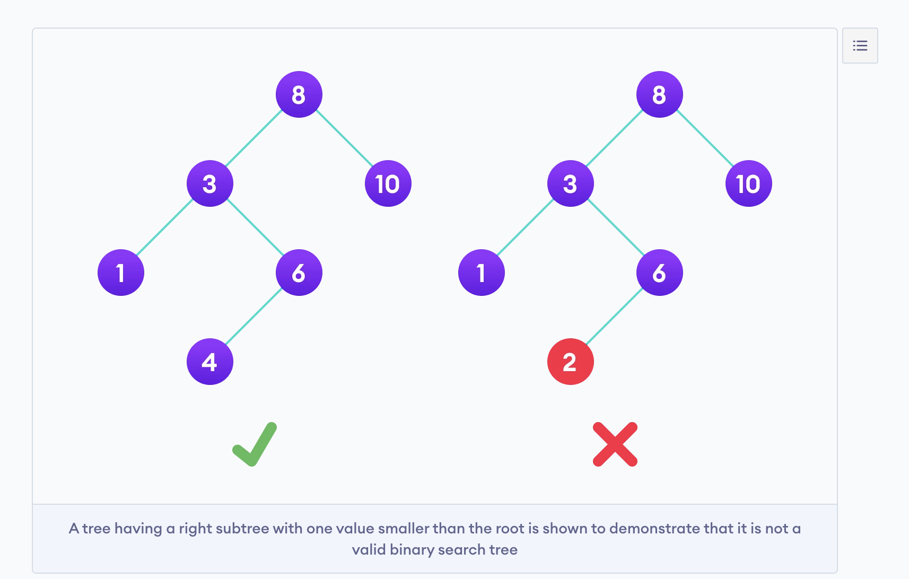

## Binary Search Tree:

- The left subtree of a node contains only nodes with keys lesser than the node’s key.
- The right subtree of a node contains only nodes with keys greater than the node’s key.
- The left and right subtree each must also be a binary search tree.

- **TC:**
- Insert O(logn) or O(h)
- Delete O(logn) or O(h)
- Search O(logn) or O(h)
- This is the average case. Worst case is O(n) for all the operations, tree can be a single straight line. 

- If you do Inorder traversal (left root right), will give sorted array. 

