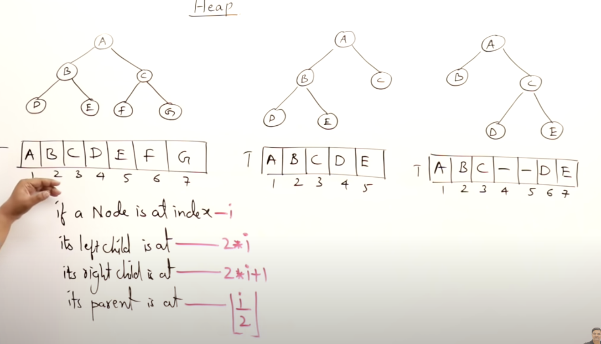
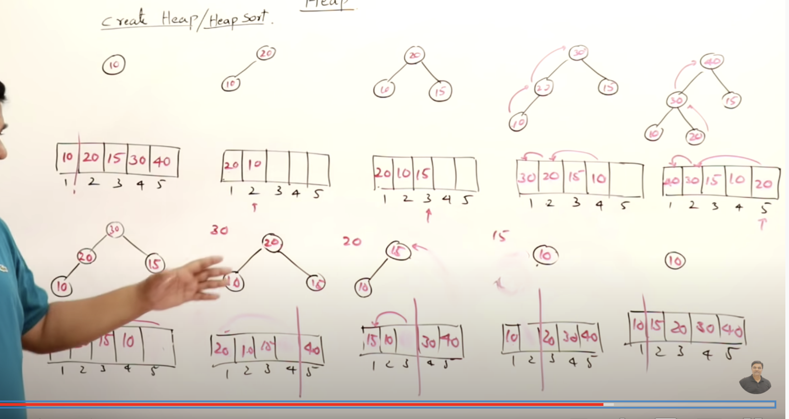

## Binary Tree Representation

- Full Binary Tree: Having maximum nodes for the given height.
- Complete Binary Tree: When you represent the binary tree in array form, it must not have missing elements.
- Full is complete but not true vice versa.
- height of a complete binary tree is O(logn)

## Heap

- Tree is a specialized data structure which follows heap property.
- **Max Heap:** Parent is always greater or equal to child. Root element is the max
- **Min Heap:** Parent is always lesser or equal to child. Root element is the minimum.
- **_TC_**

1. Finding minimum or maximum O(1)
2. Insert O(logn)
3. Remove O(logn)
4. Heaps are mainly used for finding kth largest/smallest element in array. This operation is klogn. Using arrays we have to sort and the find this is nlogn.

- Heap is a complete binary tree
- Max heap- parent > child
- Min heap- parent < child

### Insert element in a heap

- add element to the left possible node and make swaps to satisfy the condition
- worst case O(logn) best case O(1)

### Remove element in a heap

- remove the root element.
- right most element goes to the peak. (complete binary tree is satified)
- make swaps to satisfy the max or min heap condition
- worst case O(logn)

- For max heap, if you remove the element, we get the max element.

## Heapify

- Heapify is creating a heap where we insert element from the right most leaf.
- O(n)
- Heapify is different from creating heap.
- TODO Not sure why heapify is linear complexity refer to this later in depth 

## Heap Sort

- create a heap with the given elements then remove the elements.
- when we delete the element from the max heap or min heap and continue to place the deleted element in the last positon then we get all the elements sorted, this is the idea of the heap sort.
- inserting n elements - nlogn
- removing elements - nlogn
- Heap sort is O(nlogn)
- kth largest/smallest problems, we should use Heap