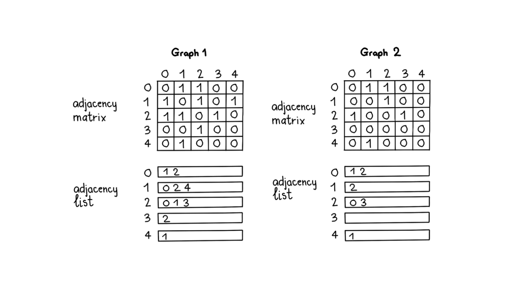

## Graph

- Data structure designed to show relationships between objects.
- Graph = nodes + edges
- Directed graph: If there exists an edge from u => v it does not imply there exists an edge from v => u.
- Undirected graph: If there exists an edge from u => v it implies there exists node from v => u.
- Adjacency list to represent graphs. Keys are nodes. Values are neighbours of the respective node.
- A graph G is an ordered set (V, E) where V are vertices of G and E are edges of G. 
- Graphs may be weighted or unweighted. Weighted graphs contain edges with weights. 

## Tree vs Graph

- In tree, we can reach a node from any node using some unique path, graphs may or may not
- Tree is a undirected connected graph with N vertices and N-1 edges. 
- Tree is acyclic, Graph may or may not 

## Graph Terminology

- Nodes i.e. vertices, edges
- Degree is defined as number of edges connected to a particular vertex for an undirected graph. 
- Total degree of a graph is twice the number of edges.  
- Degree of a directed graph - In degree and Out degree. 
- Number of incoming edges is In degree.
- Number of outgoing edges is Out degree.

## Adjacency List

- used to represent a graph
- like a dic with key as nodes and values as the edges. 

Input (graph 1): graph = [[1,2], [0,2,4], [0,1,3], [2], [1]], s = 0 #start vertex
BFS Output: 0 1 2 4 3

## Connected Components

- A directed graph is strongly connected if there is a path between all pairs of vertices.
