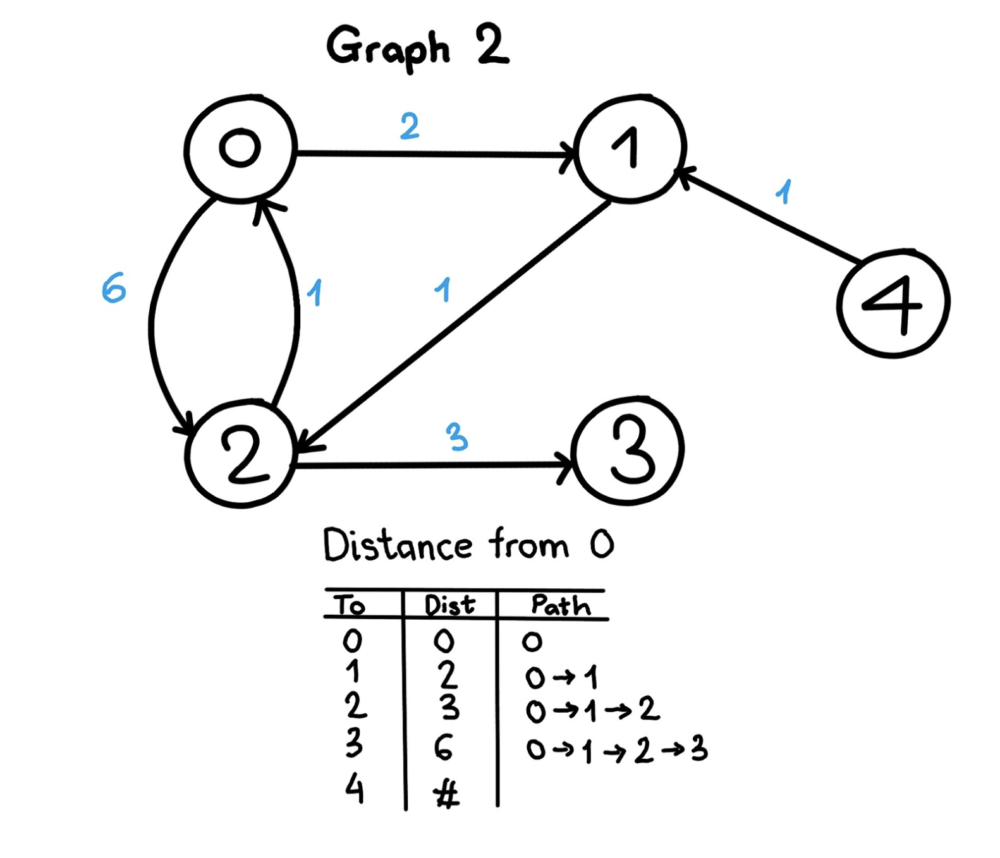

## Djikstra

- Minimization, Optimization problem- Greedy Method. 
- Both directed or undirected graph. 
- Once you have selected shortest path from a to b, now check if there exists any shortest path from b to other vertices. 
- First, we pick a node 'a' and check the nodes which are connected to initial node a. 
- Now, we calculate the distance from a to the connected nodes. Unconnected means infinity. 
- Repeat the same process by choosing the minimum weight node each iteration. 
- It can work on undirected graphs as well. We can convert the undirected edge to double edge with equal weight. 

Disadvantages: 
- Does not work on negative edges. 

- Tc: O(n^2) or O(v^2) 

```

Input: graph = [[[1, 2], [2, 6]], [[2, 1]], [[0, 1], [3, 3]], [], [[1, 1]]]
start_vertex=0


import heapq
# graph is represented by adjacency list: List[List[pair]]
# s is the source vertex

def dijkstra(graph, start_vertex):
    # set is used to mark finalized vertices
    visited = set()

    # an array to keep the distance from start_vertex to this vertex.
    # initialize all distances as infinite, except s
    dist = [float('inf')] * len(graph)
    dist[s] = 0
    
    # priority queue containing (distance, vertex)
    min_heap = [(0, start_vertex)]

    while min_heap:
        
        # pop the vertex with the minimum distance
        curr_dist, curr_vertex = heapq.heappop(min_heap)
        
        # skip if the vertex has already been visited
        if curr_vertex in visited:
            continue
        visited.add(curr_vertex)

        for connected_vertex, weight in graph[current_vertex]:
            if connected_vertex not in visited:
                
                # If there is shorted path from s to v through u.
                # start -> current -> vertex
                if dist[connected_graph] > (dist[current_vertex] + weight):
                    
                    # Updating distance of v
                    dist[connected_graph] = dist[current_vertex] + weight
                    
                    # insert to the queue
                    heapq.heappush(min_heap, (dist[connected_vertex], connected_vertex))

    return dist
```


