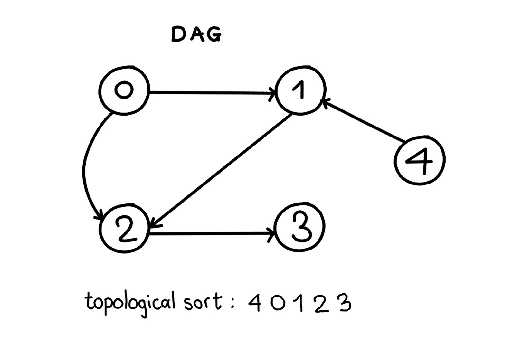

## Topological sort

- In a directed, acyclic graph, if there is an edge from u to v. Topological sort should contain u first and then v. 
- a graph can contain more than 1 topological sort
- TC- O(V + E)

Applications- 

- Representing course prerequisites
- In detecting deadlocks

## Given a DAG, return the topological sorting

- Input: graph = [[1,2], [2], [3], [], [1]]
- Output: 4 0 1 2 3

